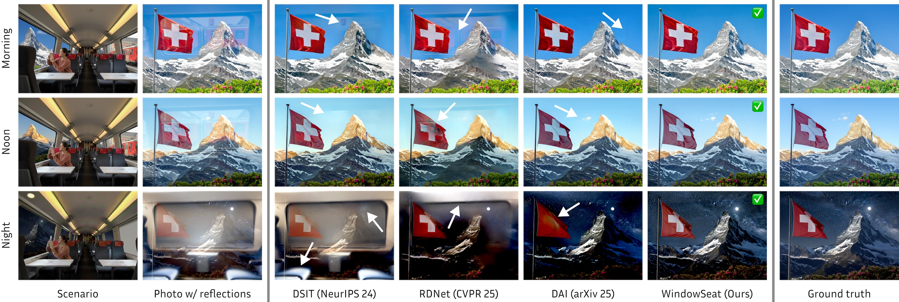
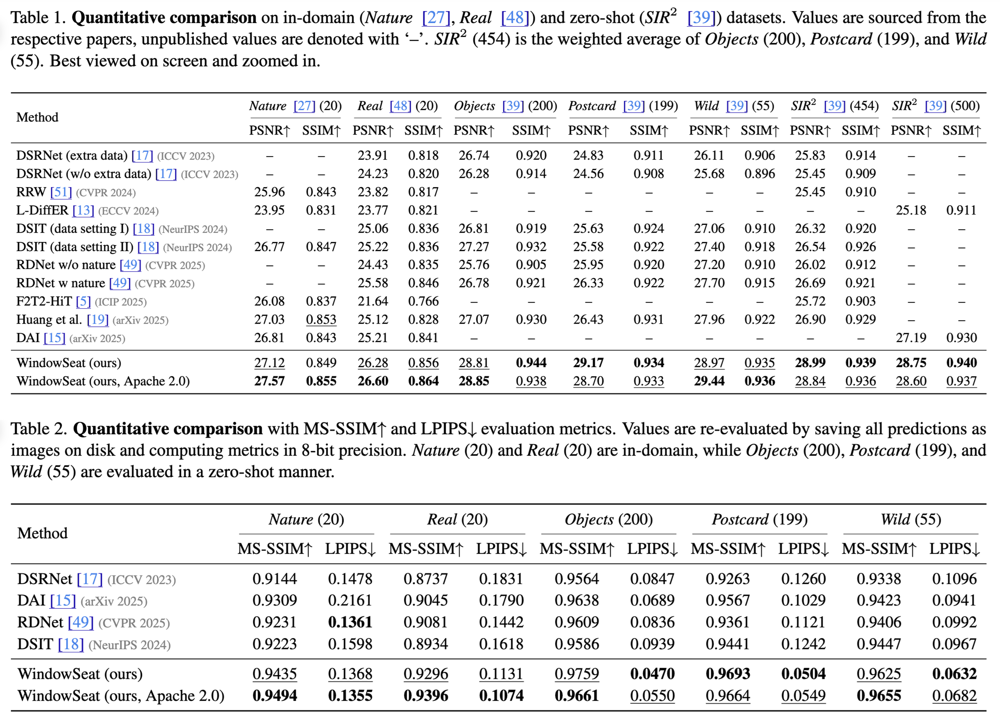

<h1 style="text-align:center;">🪟 WindowSeat: Reflection Removal through Efficient Adaptation of Diffusion Transformers</h1>

<p align="center">
  <a href="https://hf.co/spaces/huawei-bayerlab/windowseat-reflection-removal-web"></a>
  <a href="https://arxiv.org/abs/2512.05000"></a>
  <a href="https://huggingface.co/huawei-bayerlab/windowseat-reflection-removal-v1-0"></a>
  <a href="LICENSE.txt"></a>
</p>

<p align="center">
  <b>Daniyar Zakarin</b><sup>*1,2</sup>,
  <b>Thiemo Wandel</b><sup>*2</sup>,
  <b>Anton Obukhov</b><sup>†1,2</sup>,
  <b>Dengxin Dai</b><sup>2</sup>
  <br>
  <sub>
    <sup>1</sup>ETH Zurich &nbsp;&nbsp;|&nbsp;&nbsp;
    <sup>2</sup>Huawei Bayer Lab &nbsp;&nbsp;|&nbsp;&nbsp;
    <sup>*</sup>Equal contributors &nbsp;&nbsp;|&nbsp;&nbsp;
    <sup>†</sup>Project lead
  </sub>
</p>





## Visualizations


## Quick Start
### Environment & Requirements

Code tested on a **CUDA GPU with 24 GB VRAM**.

Create and activate the environment:
```bash
git clone https://github.com/huawei-bayerlab/windowseat-reflection-removal.git
cd windowseat-reflection-removal
conda env create -f environment.yaml
conda activate windowseat
```

### Inference: Removing Reflections with WindowSeat

```bash
python windowseat_inference.py
```

This will:

- ⬇️ Download the Qwen-Image-Edit 2509 backbone and WindowSeat LoRA from Hugging Face. If you are prompted to log in, please provide a read access token from Hugging Face → Settings → Access Tokens. When asked 'Add token as git credential? (Y/n)', select 'n'. 
- 🪞 Remove reflections from input images (example_images)
- 💾 Save predictions to an output folder (outputs)  

You can also pass your own directories:

```bash
python windowseat_inference.py \
  --input-dir /path/to/your/input_images \
  --output-dir /path/to/save_predictions
```

By default, the script uses the short edge of the image as the tile size. To increase the number of tiles for high resolution images, you can set:
```bash
python windowseat_inference.py --more-tiles
```

## Reproducibility



To reproduce the WindowSeat (ours, Apache 2.0) numbers, run 
```bash 
python windowseat_reproducibility.py
```
This will: 
- ⬇️ Download Nature, Real, and SIR2 500 datasets to data/evaluation/test_datasets
- 🪞 Remove reflections from all datasets
- ⚖️ Compute metrics between prediction images and ground truth

Metrics may vary slightly due to nondeterminism from the ones reported in the tables. 
To validate on an already downloaded dataset or a custom dataset, you can pass additional arguments:
```bash
python windowseat_reproducibility.py --input-folder /path/to/input-images --output-folder /path/to/output --gt-folder /path/to/ground_truth 
```

By default, the evaluation will use batch size of 2 and number of workers of 1. You can increase them with cli arguments:

```bash
python windowseat_reproducibility.py --batch-size=4 --num-workers=4
```

## Troubleshooting

| Problem                                                                                                                                      | Solution                                                       |
|----------------------------------------------------------------------------------------------------------------------------------------------|----------------------------------------------------------------|
| (pip) Errors installing requirements via `pip install -r requirements.txt` | `python -m pip install --upgrade pip` |
| (pip) Other package errors | Use conda environment with pinned package versions: `conda env create -f environment.yaml` |

## Citation
Please cite our paper:

```bibtex
@misc{zakarin2025reflectionremovalefficientadaptation,
  title        = {Reflection Removal through Efficient Adaptation of Diffusion Transformers},
  author       = {Daniyar Zakarin and Thiemo Wandel and Anton Obukhov and Dengxin Dai},
  year         = {2025},
  eprint       = {2512.05000},
  archivePrefix= {arXiv},
  primaryClass = {cs.CV},
  url          = {https://arxiv.org/abs/2512.05000},
}
```

## License

The code and models of this work are licensed under the Apache License, Version 2.0.
By downloading and using the code and model you agree to the terms in [LICENSE](LICENSE.txt).